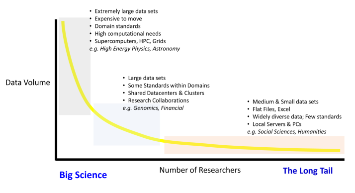

<HEAD><link rel="stylesheet" href="font-awesome-4.3.0/css/font-awesome.min.css"></HEAD>

## <i class="fa fa-link fa-1.5x"></i> https://github.com/ropensci/rrrpkg
<center>

</center>


## Tony Hey 'Open Science Decoded'




---

<div><span style="font-size:2em; line-height:1em">
"We introduce the concept of a compendium as both a container for the different elements that make up the document and its computations (i.e. text, code, data,...), and as a means for distributing, managing and updating the collection." 
</div></span>
-- Gentleman, R. and Temple Lang, D. (2004). Statistical analyses and reproducible research. Bioconductor Project Working Papers.  http://biostats.bepress.com/bioconductor/paper2/

---

<div><span style="font-size:2.5em; line-height:1.5em">
<i class="fa fa-file-text-o fa-1.5x"></i> README.md    
<i class="fa fa-folder-open fa-1.5x"></i> data
</div></span>

---

<div><span style="font-size:2.2em; line-height:1.5em">
<i class="fa fa-file-text-o fa-1.5x"></i> README.md    
<i class="fa fa-folder-open fa-1.5x"></i> data  
<i class="fa fa-folder-open fa-1.5x"></i> R
</div></span>

---

<div><span style="font-size:2em; line-height:1.5em">
<i class="fa fa-file-text-o fa-1.5x"></i> README.md    
<i class="fa fa-folder-open fa-1.5x"></i> data  
<i class="fa fa-folder-open fa-1.5x"></i> R  
<i class="fa fa-folder-open fa-1.5x"></i> man
</div></span>

---

<div><span style="font-size:2em; line-height:1.5em">
<i class="fa fa-file-text-o fa-1.5x"></i> README.md    
<i class="fa fa-folder-open fa-1.5x"></i> data  
<i class="fa fa-folder-open fa-1.5x"></i> R  
<i class="fa fa-folder-open fa-1.5x"></i> man  
<i class="fa fa-folder-open fa-1.5x"></i> tests
</div></span>

---

<div><span style="font-size:1.8em; line-height:1.5em">
<i class="fa fa-file-text-o fa-1.5x"></i> README.md    
<i class="fa fa-folder-open fa-1.5x"></i> data  
<i class="fa fa-folder-open fa-1.5x"></i> R  
<i class="fa fa-folder-open fa-1.5x"></i> man  
<i class="fa fa-folder-open fa-1.5x"></i> tests  
<i class="fa fa-file-code-o fa-1.5x"></i> DESCRIPTION  
<i class="fa fa-file-code-o fa-1.5x"></i> NAMESPACE  
<i class="fa fa-file-text-o fa-1.5x"></i> LICENSE
</div></span>

---

<div><span style="font-size:1.7em; line-height:1.5em">
<i class="fa fa-file-text-o fa-1.5x"></i> README.md    
<i class="fa fa-folder-open fa-1.5x"></i> data  
<i class="fa fa-folder-open fa-1.5x"></i> R  
<i class="fa fa-folder-open fa-1.5x"></i> man  
<i class="fa fa-folder-open fa-1.5x"></i> tests  
<i class="fa fa-file-code-o fa-1.5x"></i> DESCRIPTION  
<i class="fa fa-file-code-o fa-1.5x"></i> NAMESPACE   
<i class="fa fa-file-text-o fa-1.5x"></i> LICENSE  
<i class="fa fa-folder-open fa-1.5x"></i> src     
</div></span>

---

<div><span style="font-size:1.5em; line-height:1.5em">
<i class="fa fa-file-text-o fa-1.5x"></i> README.md    
<i class="fa fa-folder-open fa-1.5x"></i> data  
<i class="fa fa-folder-open fa-1.5x"></i> R  
<i class="fa fa-folder-open fa-1.5x"></i> man  
<i class="fa fa-folder-open fa-1.5x"></i> tests  
<i class="fa fa-file-code-o fa-1.5x"></i> DESCRIPTION  
<i class="fa fa-file-code-o fa-1.5x"></i> NAMESPACE   
<i class="fa fa-file-text-o fa-1.5x"></i> LICENSE  
<i class="fa fa-folder-open fa-1.5x"></i> src   
<i class="fa fa-folder-open-o fa-1.5x"></i> manuscript 
</div></span>

---

<div><span style="font-size:3em; line-height:1.5em">
<i class="fa fa-folder-open-o fa-2x"></i> manuscript 
</div></span>


## A Minimal Example

We examine the relationship between speed and stopping
distance using a linear regression model:
$Y = \beta_0 + \beta_1 x + \epsilon$.

```{r model, fig.width=3, fig.height=2, fig.align='center'}
par(mar = c(4, 4, 1, 1), mgp = c(2, 1, 0), cex = 0.8)
plot(cars, pch = 20, col = 'darkgray')
fit <- lm(dist ~ speed, data = cars)
abline(fit, lwd = 2)
```
The slope of a simple linear regression is `r coef(fit)[2]`.


## Compendium+

<div><span style="font-size:3em; line-height:1.5em">
<i class="fa fa-file-code-o fa-1.7x"></i> .travis.yml    
<i class="fa fa-file-code-o fa-1.7x"></i> Dockerfile     
<i class="fa fa-file-code-o fa-1.7x"></i> circle.yml     
 
</div></span>


---

<center>

<center>


---

<center>

<center>

---

## Colophon

Presentation written in [R Markdown using ioslides](http://rmarkdown.rstudio.com/ioslides_presentation_format.html)

Compiled into HTML5 using [RStudio](http://www.rstudio.com/ide/) & [knitr](http://yihui.name/knitr)

Source code hosting:
https://github.com/benmarwick/BIDS-repro2015-lightning-talk

ORCID: http://orcid.org/0000-0001-7879-4531

Licensing: 

* Presentation: [CC-BY-3.0](http://creativecommons.org/licenses/by/3.0/us/)

* Source code: [MIT](http://opensource.org/licenses/MIT) 


